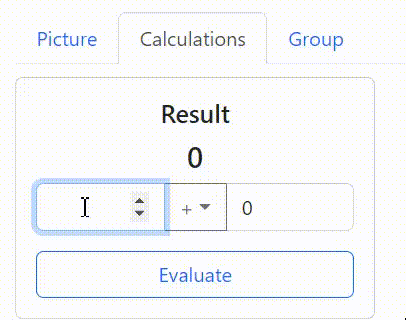
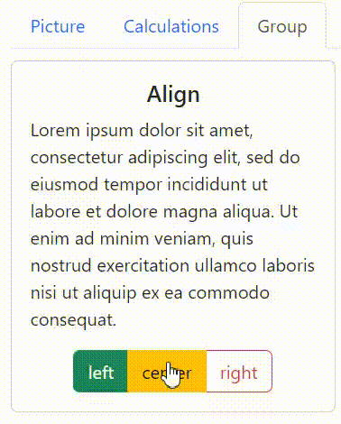

# `Task. React Testing Library`

We have an application with next - 3 tabs.  
On activation any of them only corresponding component is displayed.

## `Please, test the components of the application`

### `1. App component`
Write tests for App component in 'App.test.js' 
The test should check 
 - if image is displayed when the first tab is selected
 - if Calculation component is displayed when the second is selected
 - if ButtonGroup component is displayed when the third tab is selected 
 Also, test should check if components are not displayed if they do not correspond to the currenc active tab.

### `2. Calculations component`
 
Write tests for Calculations component in 'Calculations.test.js' 
The test should check if evaluation of the result is correct

### `3. ButtonGroup component`
 
Write tests for ButtonGroup component in 'ButtonGroup.test.js' 
The test should check if text alignment in the paragraph is correct, corresponding to selected option.

*Note: there are components in the folder __brokenComponents__.  These components are similar to the original ones, but they are with mistakes.  These mistakes are described in component files.  You can use these broken components to check if your tests will find the mistakes. To do this, just replace the original components with the broken ones and run your tests.*
